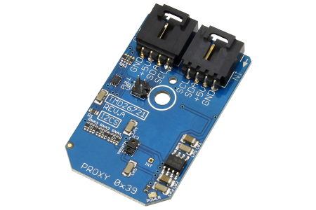

[](https://www.controleverything.com/content/Proximity?sku=TMD26721_I2CS)
# TMD26721
TMD26721 Proximity Sensor

The TMD26721 is an infrared digital proximity detector

This Device is available from ControlEverything.com [SKU: TMD26721_I2CS]

https://www.controleverything.com/content/Proximity?sku=TMD26721_I2CS

This Sample code can be used with Raspberry Pi, Arduino, Beaglebone Black and Onion Omega.

## Java
Download and install pi4j library on Raspberry pi. Steps to install pi4j are provided at:

http://pi4j.com/install.html

Download (or git pull) the code in pi.

Compile the java program.
```cpp
$> pi4j TMD26721.java
```

Run the java program.
```cpp
$> pi4j TMD26721
```

## Python
Download and install smbus library on Raspberry pi. Steps to install smbus are provided at:

https://pypi.python.org/pypi/smbus-cffi/0.5.1

Download (or git pull) the code in pi. Run the program.

```cpp
$> python TMD26721.py
```

## Arduino
Download and install Arduino Software (IDE) on your machine. Steps to install Arduino are provided at:

https://www.arduino.cc/en/Main/Software

Download (or git pull) the code and double click the file to run the program.

Compile and upload the code on Arduino IDE and see the output on Serial Monitor.

## C

Download (or git pull) the code in Beaglebone Black.

Compile the c program.
```cpp
$>gcc TMD26721.c -o TMD26721
```
Run the c program.
```cpp
$>./TMD26721
```

## Onion Omega

Get Started and setting up the Onion Omega according to steps provided at :

https://wiki.onion.io/Get-Started

To install the Python module, run the following commands:
```cpp
opkg update
```
```cpp
opkg install python-light pyOnionI2C
```

Download (or git pull) the code in Onion Omega. Run the program.

```cpp
$> python TMD26721.py
```

## Windows 10 IoT Core
 
To download Windows 10 IoT Core, visit Get Started page
 
https://developer.microsoft.com/en-us/windows/iot/GetStarted
 
Download (or git pull) the sample, make a copy on your disk and open the project from Visual Studio.

Note: Your IoT Core device and development PC should be connected to same local Network.
#####The code output is the raw value of proximity.
